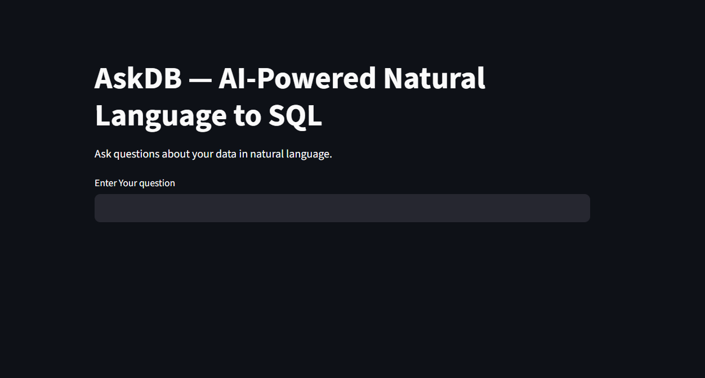
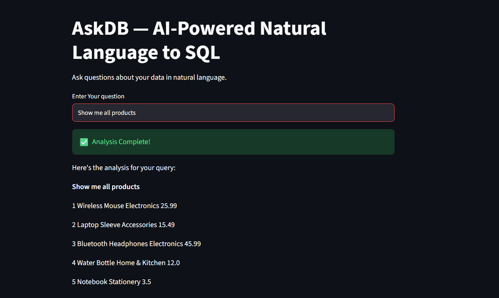

# AskDB

### AI-Powered Natural Language to SQL

AskDB converts natural-language questions into SQL queries and executes them against a relational database — no SQL knowledge required.

## 📸 Screenshots

### AskDB Interface



### Query Results



## ✨ Features

- Natural language database queries
- AI-powered SQL generation
- Automatic database schema extraction
- SQL JOIN support
- Filtering, sorting, and aggregations
- Read-only SQL validation
- SQLite database integration
- Streamlit interface

## 🛠️ Tech Stack

- Python
- Groq API
- OpenAI GPT-OSS-20B
- LangChain
- SQLAlchemy
- SQLite
- Streamlit
- uv

## 🔄 How It Works

```text
User Question
      ↓
Database Schema
      ↓
LLM generates SQL
      ↓
SQL validation
      ↓
SQLite execution
      ↓
Results
```

## 💡 Example

**Question:**

> Show each customer's orders

**Generated SQL:**

```sql
SELECT customers.name,
       orders.order_id,
       orders.order_date,
       orders.total_amount
FROM customers
JOIN orders
    ON customers.customer_id = orders.customer_id;
```

**Result:**

```text
1  Alice Johnson  1  2024-05-05  83.47
1  Alice Johnson  4  2024-06-10  12.00
2  Bob Smith      2  2024-05-07  15.49
3  Charlie Lee    3  2024-06-02  57.99
```

## 📂 Project Structure

```text
AskDB/
│
├── outputs/
│   ├── image1.png
│   └── image2.png
│
├── test/
├── .env
├── .gitignore
├── Askdb.db
├── create_database.py
├── frontend.py
├── main.py
├── pyproject.toml
├── req.txt
└── uv.lock
```

## ⚙️ Setup

### 1. Clone the repository

```bash
git clone https://github.com/<your-username>/AskDB.git
cd AskDB
```

### 2. Install dependencies

```bash
uv sync
```

### 3. Add your Groq API key

Create `.env`:

```env
GROQ_API_KEY=your_groq_api_key
```

### 4. Run the application

```bash
uv run streamlit run frontend.py
```

## 👨‍💻 Author

**Pramod B**
